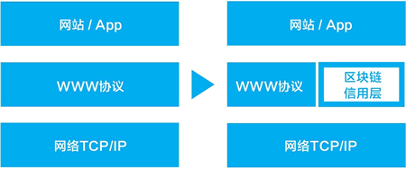
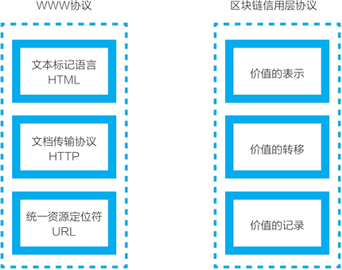
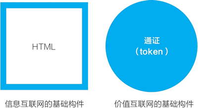
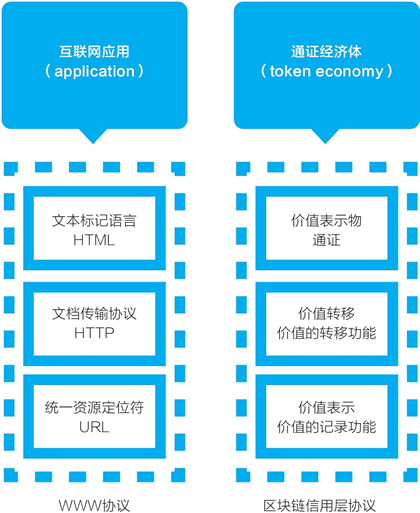
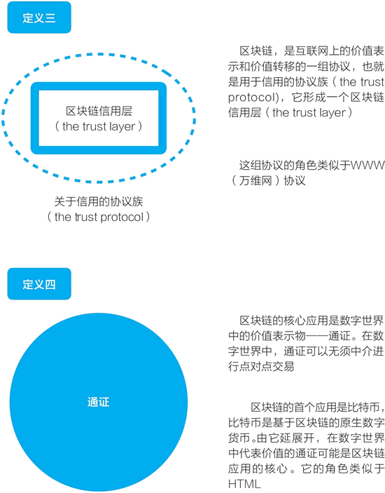

# 区块链技术革命

“区块链，是互联网的二次革命。”  
  
“区块链，是互联网2.0。”  
  
“区块链，让我们从信息互联网跨越到价值互联网。”  
  
这是从互联网发展的视角出发，对区块链有什么意义做出的一些回答。  
  
谈起区块链的前景，人们会列举它能改变金融、能源、零售、文化、社交、游戏、物联网等，但我觉得，以上回答更为有力。  
  
从 1994 年互联网开始商业化，经过近 25 年的发展，互联网已经彻底改变了我们周围的一切——经济、产业、生活。互联网从 1995 年左右的“信息高速公路”的说法，变成了无处不在的力量。现在，如果区块链是互联网 2.0，互联网曾经带来的改变以区块链的方式再来一次，随着区块链技术的进步和相关基础设施的完善，各种意想不到的应用会涌现出来。

## 信息传递 VS 价值转移

之前，互联网处理的是“信息”；现在，互联网可以处理“价值”。从 2008 年到 2018 年，酝酿了近十年的区块链技术弥补了互联网与数字世界中一直缺失的另一半。区块链提供了在数字世界中处理价值所需的两个基础功能：价值表示与价值转移，让互联网跃迁到价值互联网（见图1）。

  
1990 年，万维网协议发明者蒂姆·伯纳斯-李写道：“一旦我们通过万维网连接信息，我们就可以通过它来发现事实、创立想法、买卖物品，以及创建新的关系，而这一切都是通过在过往时代不可想象的速度和规模来实现的。”到现在，互联网上的各种应用和服务，包括门户、视频、社交、即时通信、电商、打车、B2B、网络支付等，都是基于信息传递的基础设施、沿着他的设想逐步发展起来的。  
  
在区块链出现之后，对照之下我们发现，信息传递的一个关键特征让互联网很强大，但有一个我们之前并未曾特别关注的限制：信息传递的方式是复制。这一特征让我们在数字空间中进行价值转移时，必须依赖可信第三方的协助。那些可信第三方，即各种各样的中心化机构，比如亚马逊、淘宝、支付宝、优步、滴滴、爱彼迎、微信支付，一直以来像本来就应该有一样，存在于互联网产业之中。  
  
不管是网络零售、生活服务交易，还是企业互联网，每个从事交易的互联网项目都需要价值转移的功能，而这些平台在交易中担任信用中介的角色。特别地，在互联网上进行金钱的转移时，我们需要信用中介来居中协调，为了进行在线支付，互联网上已经产生了专门的信用中介，如 PayPal、支付宝、微信支付等。  
  
直到 2008 年，当中本聪在比特币系统中开发出区块链这个底层技术，当他尝试创造新的技术来去掉这些信用中介，让网络本身来扮演信用中介的角色时，我们开始发现，现在互联网中的各种信用中介并非必须存在。  
  
经过十年的发展，比特币系统展示了，在数字世界中价值表示可以去中心化，价值转移同样可以去中心化。  
  
现在，我们仍需要各种“信用中介”，因为到现在为止互联网数字世界中的所有基础设施都是为了信息传递而建的。  
  
未来，我们不再需要这些“信用中介”。基于区块链技术，我们可能建立一个通过网络本身进行价值表示、价值转移的全新交易基础设施。  
  
如果价值表示和价值转移可去中心化，直接通过网络本身来进行，那么我们就将从“信息互联网”跨越到“价值互联网”。  
  
要理解价值互联网，我们可以从对比信息传递方式和价值转移方式的差异开始。

## 详解价值转移的方式：记录

信息和价值是完全不同的事物，信息传递和价值转移的方式完全不同。接下来，我们分别对比几组线下物理世界和线上数字世界的案例。

#### **报纸 VS 纸币**

在线下物理世界中，信息的典型代表是报纸，而价值的典型代表是纸币。每一张报纸都是一样的，报纸编辑完成后，印刷机复制它，然后它被送到我们的手中。  
  
对比而言，虽然纸币也是由印刷机印制的，每一张 100 美元纸币代表的价值是相等的，但每一张纸币都是不一样的，每一张都有唯一的序列号。  
  
信息是可复制的，我可以复印一份报纸给你。价值不可以复制，我必须把100美元现金真的给你，而不能复印了给你。  
  
到了互联网上，数字化的信息可以完美复制，这加快了信息的流动。而和价值有关的事物在互联网中没有发生同样倍数的变化。  
  
报纸和纸币的对比如图 2 所示。

#### **纸币的电子化：信用卡与在线支付**

我们接着讨论现金交易。在商店中购物，我们付纸币现金，看起来在我们和商店收银员之间并没有任何中介。当然在这背后，这些现金会变成商店在银行账户上记录的数字，在现金交易完成之后有一个庞大的金融体系在运转。  
  
当信用卡开始普及，现金开始被电子化的塑料卡片取代时，我们在刷卡支付时，一个第三方中介就出现在我们和收银员之间，它可能是维萨、万事达、银联等。这些信用中介做的事是：当我付钱时，从我的银行账户中减去我付的钱，在商店的银行账户中加上这笔钱。  
  
在互联网出现之后，当我们在线上或线下使用支付宝、微信支付等第三方在线支付时，它们扮演着与维萨、万事达等信用卡组织类似的角色。  
  
信用卡组织和在线支付系统做的事都是进行可信的记录，即在账本上进行记录，确认金钱的转移。

#### **价值转移依靠记录：房产与汽车的案例**

在物理世界中，涉及除纸币现金之外的其他价值转移时，在多数情况下，我们转移价值的方式也是记录，而记录通常需要一个可信的第三方。  
  
以房产的转移为例。我们把一个房产转让给别人，对方付了钱，我们怎么把房产这个价值转移给他？  
  
他仅仅搬进这个房子住，并不能表示他已经拥有了这个房子的所有权。在古代，房屋买卖双方签订地契，在中文中，“契”字的含义是刻画记载，地契成为所有权的记录。  
  
到了现代社会，我们的做法是，到不动产登记中心进行登记，在政府部门管理的账本记录（不动产登记簿）上更改房屋所有权的归属，对方拿到有着他的名字的房产本——“不动产权证书”。房产这个价值的所有权转移依靠的是“记录”。  
  
对比古代和现代的做法，我们可以看到，过去的地契是去中心化的，而现代的房产登记是中心化的。  
  
类似地，我们要把一辆汽车这样的动产转让给他人，现代社会的做法也是要去交通管理部门进行记录的变更，并获得新的车辆证照，如车辆行驶证。

> 在多数现代国家中，房产与汽车这两种资产都是由国家的相关部门来进行统一登记的。我们会发现，这里有两种记录：一是中心化数据库中的记录，对中国的房产来说，这个记录存在于国土资源部门集中管理的账本——“不动产登记簿”；二是产权人拿到的附属证明，即俗称的房产证——“不动产权证书”。如果房产证与集中账本中的信息不一致，或者车辆行驶证的信息与交管局数据库中的信息不一致，那么通常的做法是以集中账本中的记录为准。

## 数字世界中的价值表示与价值转移

信息传递的主要方式是复制（见图3）。在互联网中不管是最基础的 TCP/IP 协议，还是 WWW（万维网）协议，都是专为信息传递设计的。并且，数字化的信息复制可以复制出一模一样的副本，复制效率更高，互联网给信息传递带来了巨变。

  
价值转移的主要方式是记录。从物理世界到数字世界，价值转移的方式都是记录。但是，用数据文件进行价值表示会遇到很多困难，可完美复制的数据文件和需要唯一性的价值表示形成冲突。如果表示价值的数据文件可以完美复制，那么我就可能把它支付给你，再复制一份支付给另一个人，造成双花问题。在数字世界中进行价值转移时，为了防止双花问题，我们要依赖可信第三方作为中介，由它作为交易中心进行记录。  
  
这事实上成为互联网往下一步发展的隐形障碍。  
  
在互联网上，与信息相关的产品高速发展、成本快速降低。但是，由于需要可信第三方进行协调，与价值转移有关的事依然处在成本高、效率低的状态。互联网上的价值转移仍局限在少数的价值类别上，比如在线支付系统处理的现金、在线证券交易、之前讨论的Q币与游戏币等互联网积分。  
  
中本聪设计的比特币系统，给数字世界中的价值表示和价值转移这两个关于价值的关键问题都提供了解决方案。中本聪的解决方案去掉了处在中间的可信第三方，实现了完全的去中心化，让网络自身就可以表示价值，通过网络自身来转移价值和进行记录。  
  
在互联网上，互惠经济是一种常被讨论的现象，比如开发者参与开源软件的开发，人们共同编撰百科全书，知识爱好者在社区问答社区中分享知识。过去很多人认为，这是缘于这些互联网用户有着无私和互惠的精神，这的确是这些社区得以发展的重要原因。但或许也可以说，过去人们为社区贡献了力量，而不给予相应的代表价值的事物，这可能是因为，在数字世界中一直没有方便的方法进行“价值表示”，更没有方便的办法进行“价值转移”。现在，在有了区块链和它底层的区块链技术以后，我们就有了相应的技术手段。  
  
到现在来看，对数字世界的价值表示和价值转移，比特币系统都进行了完美的概念验证，并经受住了时间的考验。比特币系统是一个试验性的系统，是极客们为了解决技术难题而开发的“技术玩具”。但从 2009 年年初开始运转起，不管比特币所表示的价值折算成法币是价值很小的 1 美元，还是高达接近 2 万美元，这一系统都运转正常。通过这一系统，我们可以在数字世界中进行价值转移，无须任何信用中介介入，比特币系统无须中介的点对点价值转移交易，被证明是有效的。  
  
当然，比特币系统和源自它的区块链技术目前才跨过概念验证阶段，要作为投入工程应用的系统，满足亿万用户的使用，仍存在较大的性能问题。但不管怎样，区块链可能成为互联网数字世界中“价值表示”和“价值转移”的基础性协议（见图4）。有了比特币系统这个样板和区块链技术，互联网和数字世界中关于价值的一切都开始发生变化。

## 价值表示功能：[分布式账本](fen-bu-shi-zhang-ben-yu-qu-zhong-xin-hua-wang-luo.md)改变了互联网上的价值表示方式

当从比特币系统中发现区块链技术时，人们首先看到的是，它是一个“分布式账本”，并将之称为分布式账本技术（distributed ledger technology，DLT）。分布式账本的核心功能是做价值的表示，比如一个人持有的比特币是分布式账本中的记录。这些被表示出来的价值，又是在交易中体现出来的，因而我们仍可从价值转移来讨论价值表示。  
  
数据文件是可完美复制的，在数字世界里，我们要转移价值就需要有一个信用中介居中协调，它们的功能是做价值所有权的记录，它们也维护着一个集中的账本用以记录。在过去的数十年内，转移金钱的信用中介（如在线支付系统）越来越易用，支付宝、微信支付在线上、线下都带来了很大的便利，它们也越来越智能，比如能更好地识别欺诈。但是，它们的组成结构未曾发生根本性的变化，见图 5 a\)：

* 信用中介处在交易双方之间，协助完成价值转移。
* 它们通常提供一个供用户使用的应用界面。
* 它们维护着一个集中的账本。
* 金钱是集中账本中的记录。 

  
比特币系统彻底地改变了这个组成结构。通过各自掌握的比特币钱包软件，我们可以在个人与个人之间进行比特币转账。如图 5 b\) 所示，在进行比特币转账时，不再有一个信用中介帮我们保存和维护一个集中的账本并处理所有权的记录。区块链的账本以分布式的方式存在于互联网上，由[去中心网络](fen-bu-shi-zhang-ben-yu-qu-zhong-xin-hua-wang-luo.md)中的节点共同维护。  
  
市面上存在多种比特币钱包，只要我们掌握自己的私钥，任何比特币钱包软件都是一样的。我们的比特币被存储与记录在分布式账本中，即有人简单说的在链上。  
  
这里还想澄清一个常见的误解。在讨论区块链的分布式账本时，常有人说每个人保存自己的账本，如果绘制成形象的图示，大体上如图 5 c\) 所示。  
  
那么，我们是保存自己的账本吗？通过这个形象的图示我们可以看到，“每个人保存自己的账本”这个说法既对又不对。说它对是因为，每个人的确可以把比特币的账本都下载下来；说它不对是因为，逻辑上我们接入了一个由包括众多节点的去中心网络维护的分布式账本，比特币账本的运转逻辑并不是每个人都保存自己的账本，然后在需要的时候拿出账本来对账，而是我们共享一个云端账本。  
  
特别地，比特币钱包中并不保存“账本”。账本是由比特币网络中的全节点维护的，而钱包软件是所谓的轻量节点或轻客户端，也叫简单付款验证客户端（simple payment verification，SPV），里面只保存了向你的地址付款的交易与区块头部。  
  
更进一步追问，在区块链上，我们的数字资产存放在哪里？我们还是对照现实中资产的存储方式来理解区块链的资产存储。  
  
比特币系统的设计在一定程度上是模拟黄金的设计。要特别说明，这里讨论的并非比特币本身有黄金一样的财富价值。对比黄金和比特币我们可以看到，比特币系统模拟的并不是实体黄金。如果我们拥有实体黄金资产，我们会拿到实物的金条、金币，将之保存在自己的保险柜中。  
  
比特币系统模拟的是我们在银行中购买的黄金资产。这些黄金资产背后有存放在某处的黄金作为支撑，但对普通人来说，我们并不能接触到这些实体的金条、金币，这些黄金资产只是我们账户中的记录而已。  
  
类似地，在比特币系统中，你并不保存自己的比特币资产，即通常情况下你并非自己保存分布式账本和它所表示的比特币。你只是保存了比特币的私钥，你的数字资产还是存在链上的。  
  
再观察银行等我们熟知的管理金钱的系统，我们存在银行的金钱资产其实是银行账本中的记录，由银行账本中的记录表示和确认我们对金钱资产的所有权。比特币系统的设计是与银行系统相似的，一个人的比特币资产是分布式账本中的记录。只不过与过去相比，这里已经发生了一个重大变化：这个账本是分布式的。  
  
这是一个“分布式的、公开的、互联的大账本”。而比特币背后的去中心网络、工作量证明共识机制和“竞争-记账-奖励”循环确保了这个账本记录的可信度。

## 价值转移功能：区块链成为互联网的价值基础协议

从此，在数字世界中，我们可以在两个人之间直接进行价值转移，无须任何中心化信用中介的介入。如果从互联网应用的角度看，这个变化是，信用中介的角色被从各种互联网应用中剥离出来，下沉成为互联网更基础性的功能，即在基础层次上，区块链担任信用中介，协助我们进行价值表示和价值转移。  
  
从比特币系统这样一个概念验证性质的系统开始，到其后的各种项目，区块链渐渐展现出对互联网的变革性意义：互联网在协议层有了价值表示和价值转移的功能，区块链成为互联网的价值基础协议。  
  
通常来说，如图 6 所示，互联网可以大体分成三层。

* 最上层，是普通用户看到网站与移动App等应用。
* 中间层，是协议层，这一层过去主要是信息传递的 WWW 等协议。
* 最底层，是网络传输硬件和网络传输协议如TCP/IP等。

  
WWW 协议和各种网站、App 应用都是建立在硬件网络基础上的。现在看来，区块链带来的变化不是发生在普通用户看得到的应用部分，网站和 App 可能仍将保持它们现在的模样，同时比特币、以太坊等各种区块链去中心网络也仍是运行在现有互联网硬件网络之上的。  
  
区块链带来的变化发生在中间的协议层。区块链给互联网带来了进行价值表示和价值转移的新协议。由此我们发现，互联网的结构就发生了根本性的变化。  
  
在《商业区块链》一书中，区块链专家威廉·穆贾雅将中间的协议层称为信用层（the trust layer）。我认为，由于现在尚处于发展早期，为了便于理解，如图 6 所示，将这个新协议层称为“区块链信用层协议”（blockchain trust layer protocol）可能更直观明了。  
  
类似于 WWW 协议，区块链信用层协议由一组协议构成，在现有硬件网络之上，形成了一个协助我们进行价值表示和价值转移的新层次。这组协议目前仍未定型，也尚未被广泛认可，在持续发展中。  
  
互联网上一次出现协议级的变化是蒂姆·伯纳斯-李发明了 WWW 协议。WWW 协议把互联网塑造成我们现在所知的互联网，给经济、社会、生活带来了巨大的变革，在这中间只发生过一些对信息传递的相关协议的修补和升级。  
  
这一次，互联网增加了全新的一组协议——用于价值表示和价值转移的区块链信用层协议。  
  
巨变才刚刚开始。  
  
我们还可以用一个微观的事物类比来看：为什么把信用中介下沉到基础层次带来的变动是巨大的？为什么协议变化带来的变动是巨大的？  
  
我们把互联网看成一个平台，把信用中介看成其上的一个应用。比如，在Facebook或微信这样的社交网络平台上，为了满足用户的需求，第三方公司可以开发某种特定的应用。但这些公司始终要面对一个艰难的问题：如果平台做了这个功能，全面开放这个能力，你怎么办？当平台在平台级别提供一种能力后，所带来的变化是：一方面，第三方开发的应用可能没有存在的必要；另一方面，当平台把一个能力开放给所有人时，更多人可以利用它开发新产品，甚至更多的个人可以直接利用这个能力。当微信从2017年开始提供小程序功能时，应用开发变得方便，大量的小程序应用涌现出来，大幅度改变了移动互联网的应用生态。

## 价值表示物：数字世界中表示价值的通证

比特币是区块链技术的第一个应用，也是到目前为止最重要的应用，虽然它还只是一个完成了概念验证的系统，比特币系统完成关于价值的两个功能的验证：价值表示和价值转移。  
  
我们已经讨论了价值表示和价值转移两个功能，接下来讨论用区块链的这两个功能实现的价值表示物——通证。  
  
要更好地理解通证，我们还是从比特币说起。通常，比特币被称为“加密数字货币”，它是一种数字商品，是被凭空发行出来的。从技术角度说，中本聪创造的比特币是一种在数字世界中可以代表价值的事物。作为技术极客，中本聪解决了一个技术难题：如何在数字世界中表示价值？  
  
他的解决方案侧重在技术本身，而并没有考虑“比特币是不是有内在价值”，也没有考虑“人们会不会普遍接受它”。一枚比特币的价格是多少，是由自由市场交易决定的。它逐渐被越来越多的人接受，是时间累积而来的。比特币的价格以及谁接受它都受到很多偶然因素的影响。现在看来，比特币是一种非常独特的价值表示，背后没有任何物理世界或数字世界中的对应价值作为支撑。  
  
随着对比特币关注度的提升，更多人试图进一步改进比特币这个价值表示物、比特币系统和它底层的区块链技术。  
  
2013 年年底，以太坊创始人维塔利克首次发布以太坊白皮书，他准备开发一个新的区块链项目，在前人尝试的路径上继续改进和发展。他对到那时为止的比特币的改进做了如下梳理，他写道，常被提及的应用包括：

1. 使用链上数字资产来代表定制货币和金融工具（染色币，colored coins）；
2. 某种基础物理设备的所有权（智能资产，smart property）；
3. 如域名一样的不可互换的资产（域名币，Namecoin）；
4. 以及复杂的应用来直接控制转移数字资产，如采用事先制定的规则（智能合约，smart contracts）；
5. 甚至基于区块链的分布式自治组织（DAOs）。

  
现在再回顾我们可以看到，迄今为止，从比特币开始的区块链的开发和应用有以下四条主要路径：  
  
1\) 从比特币延展的各种替代币（altcoin），主要有莱特币等。通常，它们只是对比特币代码库的参数进行小修改，然后用这组程序代码运行自己的系统。它们和比特币系统一样包括三个部分：加密数字货币、分布式账本、去中心网络。在中文中，替代币也常被称为“竞争币”“山寨币”。  
  
2\) 借鉴比特币区块链的设计，开发所有人都可以接入的全新公有链，典型的有 Steem、以太坊、EOS 等。有意思的是，过去站在以比特币系统为世界中心的视角看，以太坊曾被视为替代链（alt chain）。  
  
3\) 借鉴比特币区块链的设计思想，开发适合单个企业或多个企业使用的区块链开源软件，这常被称为联盟链。典型代表是由 IBM 开发、现在由 Linux 基金会管理的超级账本项目（HyperLeger）。  
  
4\) 以比特币区块链为基础，开发基于它的协议（meta-protocol，又译为元协议、外设协议），提升性能，使之便于应用，比如钱包、侧链、跨链、支付、交易所等。  
  
以上除了第一类以外，其他三类都已经超越比特币最初的加密数字货币（电子现金）的想法，凭空发行的加密数字货币可能只是价值表示物的一种早期特殊形式。  
  
一个重大变化发生在 2017 年。这一年，除了竞争币和各类公有链发行的原生货币之外，以太坊的一个功能开始被广泛地使用。这个功能是，任何人都可以在以太坊上按其 [ERC20](http://c.biancheng.net/view/1922.html) 通证标准编写智能合约，发行通证。  
  
这些通证可以在数字世界中表示某种价值，这些价值既可以是线上的，也可以是线下的；既可以是已经存在的，也可以是设想中的。有些人甚至在没想好用它代表什么价值之前，就已经在以太坊上将之发行出来，当然这造成了不少问题。以太坊还创造了一种常被称为代币众筹或首次代币发行（initial coin offering）的机制：人们可以用以太币（ETH）去参与众筹，换得相应的通证。  

> 在后续章节中，我会详细解释以太坊的原理、ERC20通证标准以及代币众筹。

创建通证的方便、用通证获取资金的便利以及随之而来的财富效应，使得市场上通证的数量暴增，再加上 2017 年比特币和以太币的价格暴涨，这些因素综合起来引发了一场投机狂潮。在 2017 年年底，在数字世界中代表价值的数字资产的总价值暴涨，然后在 2018 年年初又暴跌。  
  
但不管怎样，从 2017 年年中到 2018 年年初发生的事，让区块链走出了极客圈子，变得广为人知。更多的人开始意识到它的价值，并认识到，区块链和在过去20年中带来巨变的互联网有着相似的结构，它既有技术的一面，又有经济的一面。  
  
从比特币到以太坊，价值互联网的关键基础构件之一“通证”呈现在所有人的面前。  
  
你可能注意到了，我们始终在用通证的说法，而没有用很多人常用的中文词“代币”。“代币”说法和“币”这个字，常让人们关注通证的货币特性。我赞同通证经济专家孟岩与中关村区块链产业联盟发起人元道等提出的中文翻译：token，可称为“通证”，指“可流通的加密数字权益证明”。  
  
对区块链的经济一面，新的认知正在形成。延续过去的说法，很多人把比特币、以太币等基础公链的原生货币，以及通过以太坊等基础公链的智能合约发行出来的通证都称为加密数字货币。但人们逐渐发现，不是通证是加密数字货币的一种特殊情况，而是反过来，原生加密数字货币是通证的一种特殊情况。因此，在说通证时，我们采用了最广泛的含义，把数字世界中，基于区块链的各种价值表示物都称为通证。  
  
我们还可以用 WWW 协议来类比理解区块链。WWW 协议包括三个部分：文本标记语言 HTML、文档传输协议 HTTP、指定文档网络地址的统一资源定位符 URL（见图7）。

  
大体上，区块链信用层协议进行记录的价值表示功能可类比为统一资源定位符 URL，进行价值转移的功能可类比为文档传输协议 HTTP，而区块链上的价值表示物（通证）可看成文本标记语言HTML（见图 8）。

过去，对于在 WWW 协议上可以构建什么样的应用，这个问题的答案是被逐步发现的。现在在价值互联网上，对于在区块链上可以开发什么应用，这个问题的答案也是等着在实践中被发现出来的。  
  
总的来说，现在在数字世界中，类似于 HTML 的代表价值的语言（通证）已经准备好了。“怎么用通证，通证有什么用”等问题等待着创造性的回答。  
  
在信息互联网中，基于万维网协议我们构建各类互联网应用；在价值互联网中，基于区块链信用层协议我们可能构建各种通证经济体（见图 9）。  
  
区块链的第三、第四个定义如图 10 所示。

## 学习结束了，给作者来杯咖啡？



